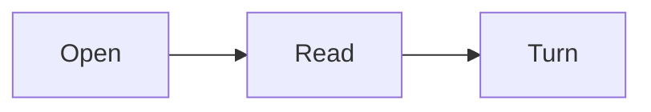

# Mark Sample

A quick tour of what **Mark** renders. Open this file to verify everything works.

## Inline formatting

Inline `code`, **bold**, *italic*, ~~strikethrough~~, ==highlight==, and a [link](https://example.com).
Emoji: :smile: :rocket: :+1: H~2~O and E=mc^2^.

> A blockquote line.
> Second line.

## Headings anchor

Open Contents to jump to a heading.

## Lists

- Plain bullet
  - Nested
- [x] Done task
- [ ] Pending task

1. Ordered
2. Items

Term
: definition (definition list)

## Code

```ts
interface User { id: number; name: string }

function greet(u: User): string {
  return `Hello, ${u.name}!`;
}
```

```python
def fib(n):
    a, b = 0, 1
    for _ in range(n):
        a, b = b, a + b
    return a
```

## Tables

| Feature    | Supported | Notes            |
| ---------- | :-------: | ---------------- |
| GFM tables |    yes    | aligned columns  |
| Task lists |    yes    | checkboxes       |
| Math       |    yes    | KaTeX            |

## Math

Inline: $a^2 + b^2 = c^2$ and a fraction $\frac{1}{2}$.

Block:

$$
\int_0^{\pi} \sin(x)\,dx = 2
$$

## Callouts

:::tip
Tips work out of the box.
:::

:::warning
Heads up about something.
:::

:::details More
Collapsible details block.
:::

## Footnote

Markdown footnotes are supported[^1].

[^1]: This is the footnote text.

---

## Chart

```chart
bar
title Hours
Reading | 12
Notes | 7
```

## Progress plan

```plan
title This chapter
Read | 80
Notes | 45
```

## Diagram



That's the tour. Customize the look in **Settings**.
