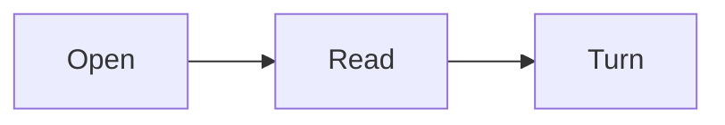

# MARK living reader demo

A public page for books, study notes, READMEs, and code knowledge.
The reading page is also the editing surface. No live copy is needed.

## Try the interactive reader

1. Tick a task below. MARK changes the Markdown for that task.
2. Double-click a table cell and type there. The same table stays on screen.
3. Press **Enter** or click outside the cell to finish. **Esc** restores that cell.
4. Select a passage, choose **Note**, and write in the floating reader control.
5. Choose **Done**. Hover its subtle underline to read the note. No paragraph moves.
6. Use **File → Version history…** to inspect an earlier version. Restore requires confirmation.
7. Use **File → Export current Markdown…** to send the current document to someone else.

Changed Markdown saves every **5 seconds**. Idle documents do not create duplicate versions.
Older versions are kept for **30 days**. MARK never expires the latest version or deletes the working file.
Old snapshots are cleaned up when the document or its history is used.

In the desktop app, edits update the opened Markdown file after a version snapshot is saved.
In a browser, MARK keeps a local working document. Export is needed to change or send the uploaded file.
Do not close MARK if **Not saved** is shown. Export the current Markdown and retry first.

## Live acceptance checklist

- [ ] Tick this task and reopen the same document.
- [ ] Double-click a table cell, type, and wait for Saved.
- [ ] Inspect Version history and restore an earlier version.
- [ ] Add a passage note, then hover its underline without moving the text.
- [ ] Copy code through its clipboard icon. No code is executed.
- [ ] Download the current table as Markdown, CSV, and agent context.
- [ ] Export the current document and check that the edits are included.

Notes live in this same Markdown file and follow the same autosave and version history.
MARK hides their source callouts from the reading flow. Only the underlined passage and hover reveal them.
**Notes** lists file-owned notes, including ones whose passage can no longer be located.
Creating a new Markdown file in an editor is a later feature. Existing legacy drafts remain recoverable.

## Joint attention: share the exact source

Use **Share** on a table, code block, chart, plan, or diagram.
Copy or download its Markdown, or download context for an agent conversation.
Table exports also offer spreadsheet-safe CSV.
The context identifies the block's filename, source lines, and source-text hash.
No content is uploaded automatically.

## Inline formatting

Inline `code`, **bold**, *italic*, ~~strikethrough~~, ==highlight==, and the [Example site](https://example.com).
Emoji: :smile: :rocket: :+1: H~2~O and E=mc^2^.

> A blockquote line.
> Second line.

## Headings anchor

Open Contents to jump to a heading.

## Lists

- Plain bullet
  - Nested
- [x] Done task
- [ ] Pending task

1. Ordered
2. Items

Term
: definition (definition list)

## Code

```ts
interface User { id: number; name: string }

function greet(u: User): string {
  return `Hello, ${u.name}!`;
}
```

```python
def fib(n):
    a, b = 0, 1
    for _ in range(n):
        a, b = b, a + b
    return a
```

## Tables

| Feature    | Supported | Notes            |
| ---------- | :-------: | ---------------- |
| GFM tables |    yes    | aligned columns  |
| Task lists |    yes    | direct toggles update the current Markdown |
| Math       |    yes    | KaTeX            |

## Math

Inline: $a^2 + b^2 = c^2$ and a fraction $\frac{1}{2}$.

Block:

$$
\int_0^{\pi} \sin(x)\,dx = 2
$$

## Callouts

:::tip
Tips work out of the box.
:::

:::warning
Heads up about something.
:::

:::details More
Collapsible details block.
:::

## Footnote

Markdown footnotes are supported[^1].

[^1]: This is the footnote text.

---

## Chart

```chart
bar
title Hours
Reading | 12
Notes | 7
```

## Progress plan

```plan
title This chapter
Read | 80
Notes | 45
```

## Diagram



## Interaction boundary

Checkpoints and supported table cells change the current Markdown. Source writes are versioned.
Use **Edit Markdown** for structural table changes and for code or artifact source.
Code is displayed, never executed. Table values are not evaluated as spreadsheet formulas.

Clipboard icons offer the current block as Markdown and agent context. Tables also offer CSV.
The code icon occupies the old Copy slot. Table and artifact icons sit below their content.
Exports create separate files. Browser downloads are requests; native export confirms its file write.

A failed save keeps the changed page in memory and blocks document switching.
Export before closing if **Not saved** remains visible. Version history is not an independent backup.
**Recovery & backup** preserves annotation and note data; export the current Markdown separately.

Customize the reading layout under **View → Reading settings…**.
