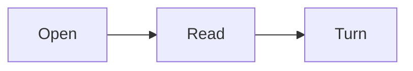

# MARK reader/editor demo

A public sample for books, study notes, READMEs, and code knowledge.
The reader keeps this source read-only. Use an editable copy to try the writing controls.

## Try the reader and writer

1. Open **Notes**, then choose **Edit source copy**.
2. Select a word in the writer and choose **Bold** or **Italic**.
3. Use **Insert → Table** to add a Markdown table. Edit its rows in the writing area.
4. Choose **Preview** to see the result.
5. Choose **Export .md** to save a separate document. The original sample stays unchanged.

For a passage note, select this sentence in the reader, choose **Note**, write an explanation, and choose **Save note**.
Scrolling the reader keeps the separate writer open.

## Joint attention: share the exact source

Use **Share** on a table, code block, chart, plan, or diagram.
Copy or download its Markdown, or download context for an agent conversation.
Table exports also offer spreadsheet-safe CSV.
The context identifies the block's filename, source lines, and source-text hash.
No content is uploaded automatically.

## Inline formatting

Inline `code`, **bold**, *italic*, ~~strikethrough~~, ==highlight==, and a [link](https://example.com).
Emoji: :smile: :rocket: :+1: H~2~O and E=mc^2^.

> A blockquote line.
> Second line.

## Headings anchor

Open Contents to jump to a heading.

## Lists

- Plain bullet
  - Nested
- [x] Done task
- [ ] Pending task

1. Ordered
2. Items

Term
: definition (definition list)

## Code

```ts
interface User { id: number; name: string }

function greet(u: User): string {
  return `Hello, ${u.name}!`;
}
```

```python
def fib(n):
    a, b = 0, 1
    for _ in range(n):
        a, b = b, a + b
    return a
```

## Tables

| Feature    | Supported | Notes            |
| ---------- | :-------: | ---------------- |
| GFM tables |    yes    | aligned columns  |
| Task lists |    yes    | rendered checkboxes; reader interaction is the next step |
| Math       |    yes    | KaTeX            |

## Math

Inline: $a^2 + b^2 = c^2$ and a fraction $\frac{1}{2}$.

Block:

$$
\int_0^{\pi} \sin(x)\,dx = 2
$$

## Callouts

:::tip
Tips work out of the box.
:::

:::warning
Heads up about something.
:::

:::details More
Collapsible details block.
:::

## Footnote

Markdown footnotes are supported[^1].

[^1]: This is the footnote text.

---

## Chart

```chart
bar
title Hours
Reading | 12
Notes | 7
```

## Progress plan

```plan
title This chapter
Read | 80
Notes | 45
```

## Diagram



## Interaction boundary

Formatting, preview, passage notes, Markdown insertion, copy, and download work in this version.
Reader checkboxes and visual table-cell editing are not yet interactive.
The next live-demo step will add persistent task toggles, editable tables, and artifact controls on an editable copy.

Customize the reading layout under **⋯ → Reading settings…**.
